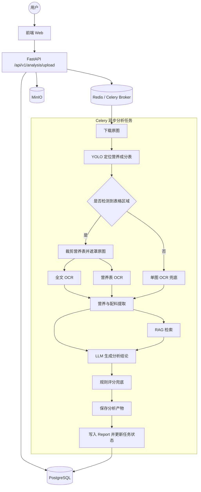

# Food Label Analyzer 分析链路说明

本文档描述 FoodGuard 后端在接收到用户上传图片后，如何完成一次完整的食品标签分析，并最终生成报告。

## 1. 总体链路

## 2. 上传与建任务

入口接口：

- [app/api/v1/analysis.py](app/api/v1/analysis.py)

处理顺序：

1. 前端把图片上传到 `POST /api/v1/analysis/upload`
2. 后端读取文件字节并校验：
   - 文件是否为空
   - 是否为 `JPG / PNG / WEBP`
   - 是否超过大小限制
   - 图片是否损坏
3. 图片写入 MinIO
4. 创建 `analysis_tasks` 记录
5. 生成固定格式的 Celery `task_id`
6. 向 `analysis.process_image` 投递异步任务

说明：

- 数据库内部初始状态为 `pending`
- 对前端暴露的初始状态为 `queued`
- 如果创建任务或入队失败，会清理已上传的 MinIO 图片

关键实现：

- [app/services/task_service.py](app/services/task_service.py)
- [app/services/storage_service.py](app/services/storage_service.py)

## 3. 异步分析任务入口

入口文件：

- [app/tasks/analysis_task.py](app/tasks/analysis_task.py)

Celery 任务：

- 名称：`analysis.process_image`
- 最大重试次数：`2`
- 软超时：`270s`
- 硬超时：`300s`

任务开始后会先把数据库状态更新为 `processing`，结束时写回：

- `completed`
- `failed`

对 OCR、存储、Embedding、LLM 这类外部依赖错误，任务会优先走有限重试；超过重试次数后才标记失败。

## 4. 图像下载与 YOLO 定位

相关实现：

- [app/tasks/analysis/persistence.py](app/tasks/analysis/persistence.py)
- [app/workers/yolo_worker.py](app/workers/yolo_worker.py)

步骤：

1. 从 MinIO 下载原图
2. 使用 YOLO ONNX 模型检测营养成分表区域
3. 若检测到 bbox：
   - 裁剪营养成分表图片
   - 对原图中表格区域做遮罩，尽量减少 OCR 干扰
4. 若未检测到 bbox：
   - 直接把原图送入 OCR

说明：

- 运行时使用的是部署模型
- 训练、对比实验和导出逻辑在仓库 `train_yolo26s/` 目录中单独维护

## 5. OCR 识别策略

相关实现：

- [app/workers/ocr_worker.py](app/workers/ocr_worker.py)
- [app/tasks/analysis/ocr_strategy.py](app/tasks/analysis/ocr_strategy.py)

当前策略分两种：

### 5.1 检测到营养表时

优先走双路 OCR：

- 一路识别遮罩后的全文文本
- 一路识别裁剪出的营养成分表

如果双路 OCR 失败，会自动退回顺序 OCR 兜底。

### 5.2 未检测到营养表时

会先识别整张图片的全文文本，再尝试对整图执行营养表识别扫描。

输出主要包括：

- `OCRTextResult`
- `TableRecognitionResult`

## 6. 结构化提取

相关实现：

- [app/workers/extractor/ingredient_extractor.py](app/workers/extractor/ingredient_extractor.py)
- [app/workers/extractor/nutrition_extractor.py](app/workers/extractor/nutrition_extractor.py)

### 6.1 配料提取

优先顺序：

1. 基于规则从 OCR 文本中定位“配料表”片段
2. 对复合配料做拆分和去重
3. 若规则提取失败，再调用 LLM 做兜底提取

输出：

- `ingredient_terms`：配料词条列表
- `ingredients_text`：配料原文或提取结果

### 6.2 营养提取

优先顺序：

1. 先尝试让 LLM 解析营养表
2. 若 LLM 结果为空或不稳定，再回退到结构化规则解析
3. 若表格结果为空，但全文 OCR 中仍可能包含营养信息，则继续从 OCR 文本兜底

可能的 `parse_method`：

- `table_recognition`
- `ocr_text`
- `llm_fallback`
- `empty`
- `failed`

## 7. RAG 检索

相关实现：

- [app/workers/rag_worker.py](app/workers/rag_worker.py)

处理逻辑：

1. 将配料词条标准化
2. 调用 Ollama Embedding 生成向量
3. 在 ChromaDB 中查询：
   - 配料知识集合
   - 标准知识集合
4. 对检索结果去重、排序、标记匹配质量

输出字段：

- `items_total`
- `retrieval_results`
- `match_quality`
- `similarity_score`

如果 Embedding 或 ChromaDB 失败，会记录监控并尽量返回空结果，而不是让整个链路静默成功。

## 8. LLM 综合分析

相关实现：

- [app/workers/llm_worker.py](app/workers/llm_worker.py)
- [app/workers/extractor/prompts/food_health_analysis.py](app/workers/extractor/prompts/food_health_analysis.py)

输入包括：

- OCR 全文
- 结构化营养信息
- RAG 检索结果
- 识别出的配料词条

LLM 负责输出：

- 总结文本
- 风险项
- 好处项
- 配料风险解释
- 不同人群建议

说明：

- LLM 输出必须满足 Pydantic schema 校验
- 若首次输出无法解析，会进入 repair 重试

## 9. 规则评分兜底

相关实现：

- [app/services/score_calculator.py](app/services/score_calculator.py)

这是当前链路里很重要的一步：

- 大模型可以生成说明和建议
- 但最终健康分不直接相信 LLM 给出的分数
- 系统会基于营养、糖、钠、添加剂、过敏原重新计算规则分

这样做的目的：

- 降低大模型分数波动
- 让评分逻辑更容易解释
- 便于论文和答辩中说明评分依据

## 10. 分析产物持久化

相关实现：

- [app/tasks/analysis/artifacts.py](app/tasks/analysis/artifacts.py)
- [app/tasks/analysis/persistence.py](app/tasks/analysis/persistence.py)

会按情况保存的产物包括：

- 原图对象键
- 检测 bbox JSON
- 遮罩图
- 营养表裁剪图
- OCR 原始结果
- 营养解析结果
- RAG 结果
- LLM 输出结果

最终写入数据库的核心表：

- `analysis_tasks`
- `reports`

报告中保存的主要字段：

- `ingredients_text`
- `nutrition_json`
- `nutrition_parse_source`
- `rag_results_json`
- `llm_output_json`
- `score`
- `artifact_urls`

## 11. 失败处理与可观测性

系统对以下情况都有显式处理：

- 上传校验失败
- Celery 入队失败
- OCR/LLM/Embedding/存储异常
- 任务超时
- 不可预期异常

相关监控与可观测性：

- `/health`：依赖健康检查
- `/metrics`：Prometheus 原始指标
- `/api/v1/metrics`：认证后的进程内指标快照

任务过程还会记录：

- 总耗时
- 各步骤耗时
- 外部依赖错误计数

## 12. 答辩时建议强调的实现点

1. 上传分析为什么做成异步任务，而不是同步接口
2. 为什么要先 YOLO 定位，再 OCR 识别
3. 为什么既用了 RAG 又用了规则评分，而不是只依赖大模型
4. 为什么报告详情既保存结构化结果，也保存中间分析产物
5. 为什么问答要绑定到单份报告，而不是全局聊天

